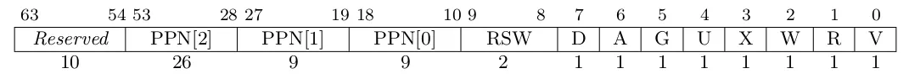

## 编程作业

首先，对于 `sys_get_time` 和 `sys_trace`。是因为 `sys_get_time` 里传了一个结构体指针，我们要把返回值放进去，指针就是一个地址，但是这个地址是用户程序视角下的虚拟地址，而我们现在来到了内核的地址空间，就不能再利用这个虚拟地址访问到同样对应的物理地址了；`sys_trace` 就更不用说了。所以，我们需要先找到当前用户程序，传入的虚拟地址，对应的物理地址，再利用内核的恒等映射区，即该物理地址用同样值的虚拟地址也能访问到，以此实现在内核里对用户程序内指定虚拟内存的读和写。

对于 `map` 而言，我的做法是先算出起始地址所在页和终止地址所在页，然后依次进行合法性检查，利用地址空间提供的 `insert_framed_area` 方法，我们只需要传入起始虚拟地址和结束虚拟地址就能结束映射；而 `unmap` 则是直接用循环调用了 `PageTable` 的 `unmap` 方法。为什么 `map` 系统调用不用 `PageTable` 的 `map` 方法呢，因为 `map` 方法要提供一个虚拟页和一个物理页，但是我们并不在乎这个虚拟页到底映射在哪，我们在乎的只是它被映射了，所以没必要使用 `map` 方法，使用封装好的 `insert_framed_area` 方法就可以了。

## 简答作业

### 1 

组成就直接引用 `rcore` 教程里的图片了：

其中的标志位用于控制内核或者用户程序对某真实物理页的操作权限，比如可读、可写、可执行、以及是否允许用户态进行操作等。

### 2

1. 包括取值缺页、读缺页、写缺页。
2. `scause` 值是 `Exception::StorePageFault` 或者 `Exception::LoadPageFault`（可以看 `trap/mod.rs`）；`stval` 值是触发缺页的虚拟地址。
3. 这样做能节省内存，比如进程想分配大量空间，但是结果最后只用了一小部分，那么我们只会申请它用的那一小部分的空间；同时也能提高效率，因为不用去分配那么多页了
4. 应该大约在几十 MB。
5. 可以在进程申请空间时，在进程控制块里记录一个目前进程申请的虚拟页、但是还没真正为其分配的范围；当进程想要访问某虚拟页时，如果在这个集合里，那么就分配一个物理页，然后再去访问页表。
6. 直接将有效位先置零就可以。

### 3

1. 还是在 `satp` 里写根页表地址，如果想切换页表修改这个字段的值就好了。
2. 可以控制页表项的 `U` 位，`U` 位正是决定该页表项是不是用户特权级下能访问的。
3. 切换到内核态、从内核态回到用户态时开销小，不需要切换地址空间，也不需要跳板了，实现简单。
4. 双页表情况下（也就是我们现在实现的这个），需要在从用户态陷入到内核态，或者从内核态返回用户态时切换页表；而单页表时，需要在进程切换时切换页表。相当于前者在 `trap` 时切换，但是在 `task` 切换时不用管，因为现在还是在内核态；但是后者是在 `task` 切换时进行处理的，因为内核本来就没有自己的地址空间。